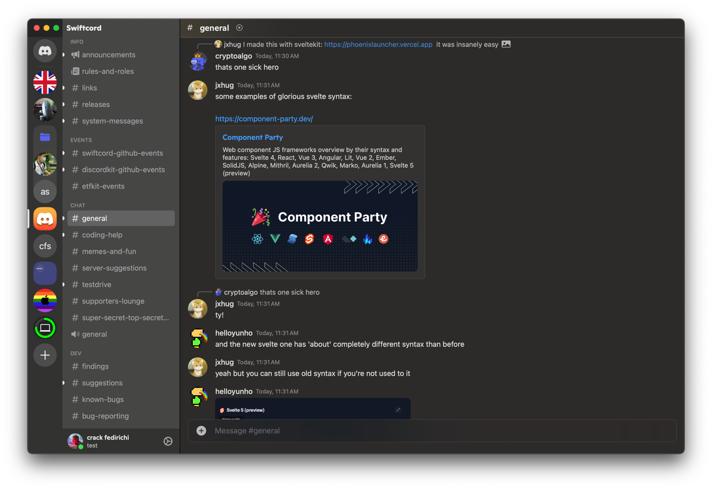

# Swiftcord Landing Site

> A simple landing site for the Swiftcord organisation, promoting Swiftcord
> and DiscordKit.

## 🧞 Commands

All commands are run from the root of the project, from a terminal:

| Command                   | Action                                           |
|:--------------------------|:-------------------------------------------------|
| `yarn`                    | Installs dependencies                            |
| `yarn run dev`            | Starts local dev server at `localhost:4321`      |
| `yarn run build`          | Build your production site to `./dist/`          |
| `yarn run preview`        | Preview your build locally, before deploying     |
